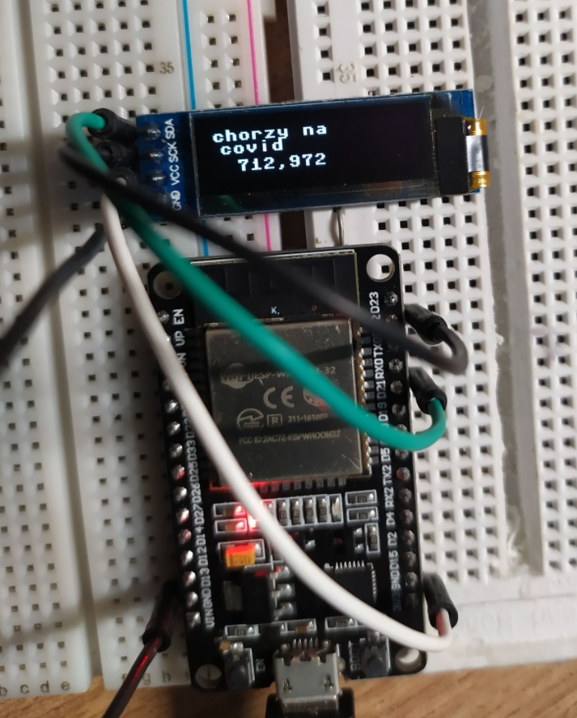

# micropython-covid-counter
esp32 with oled screen shows total amount of covid cases in Poland 

Libraries used in this project:
- ssd1306
- urrequests

Before upload rename file 'covid-counter' to 'main.py'

wiring is on the photo

LCD     / ESP32 
LCD_scl ----> pin 22 
LCD_sda ----> pin 21 
VCC     ----> 3V3 
GND     ----> GND 

